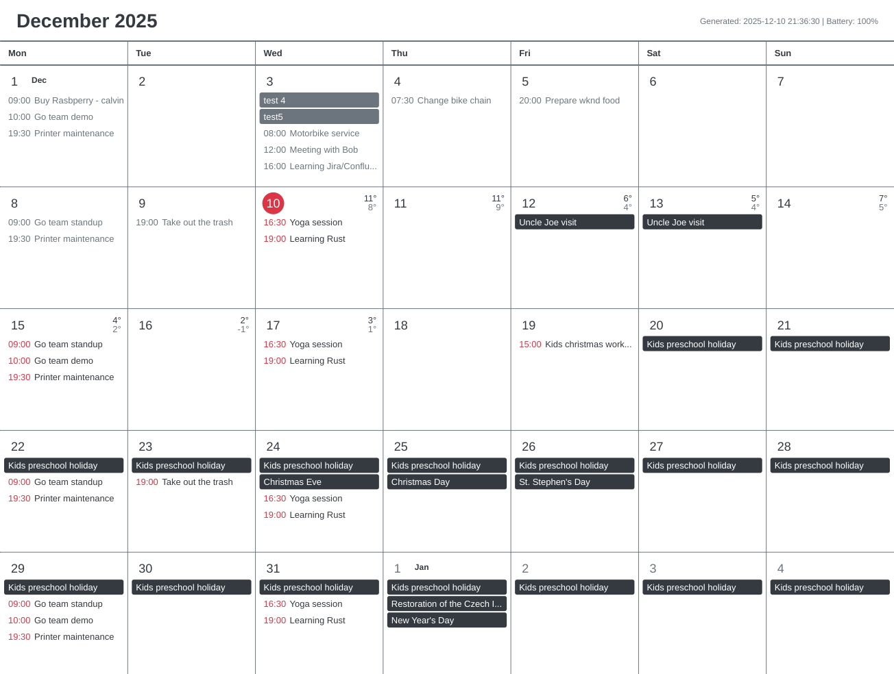
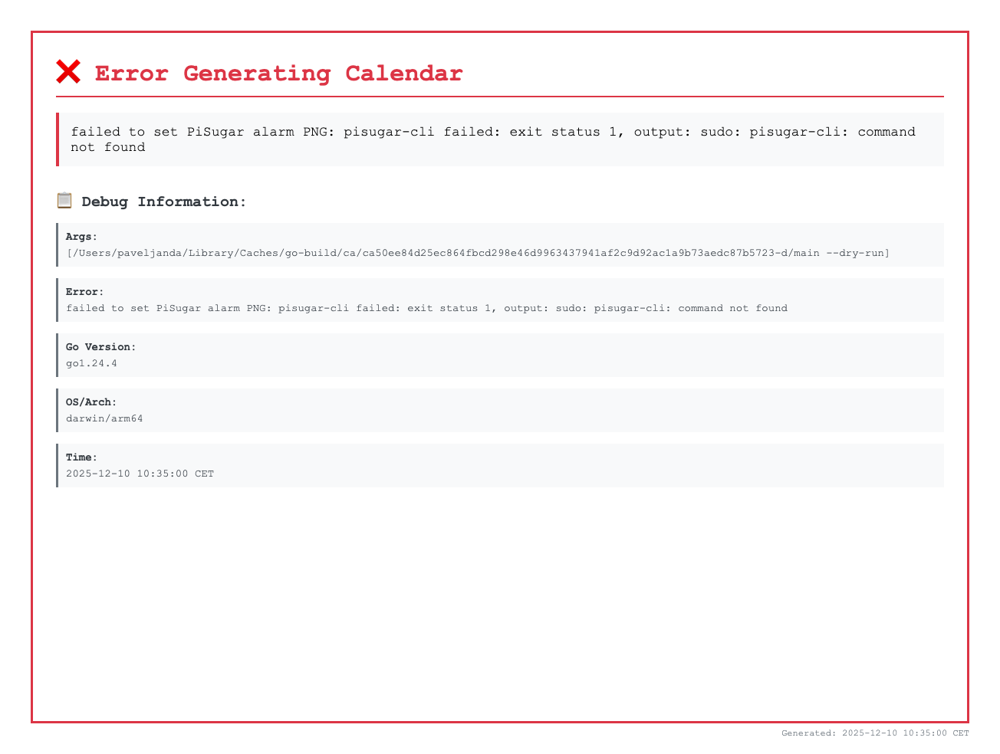

# Calvin 📅

E-ink calendar display for Raspberry Pi Zero. Renders Google Calendar + weather forecast to PNG using HTML/CSS.



## Features

- 📅 Month view calendar with current month
- 🌡️ 8-day weather forecast (day/night average temperatures shown in top-right corner of each day)
- 🎨 Optimized for Waveshare e-ink displays (4-color: white, black, red, grey)
- 📆 Multi-day events span across all days
- ⏰ Past events displayed in grey
- 🔴 Current/future event times shown in red
- 📦 Single self-contained executable with embedded Liberation Sans fonts (no external dependencies)
- ⚡ Direct graphics rendering using pure Go (no Chrome/Chromium required)

## Setup

### 1. Google Calendar API

1. Go to [Google Cloud Console](https://console.cloud.google.com/)
2. Create project → Enable **Google Calendar API**
3. Create **OAuth client ID** (Desktop app)
4. Download JSON → save as `credentials.json`

### 2. Build & Run

```bash
go mod tidy
go build -o calvin .
cp config.example.yaml config.yaml
# Edit config.yaml with your location

./calvin  # First run opens auth flow
```

### 3. Cross-compile for Pi Zero

```bash
GOOS=linux GOARCH=arm GOARM=6 go build -o calvin-arm .
```

### 4. Systemd Setup (Raspberry Pi)

To run Calvin automatically on boot and handle logging via journald (all stdout/stderr logs will be captured by systemd):

```bash
# Copy the service file
sudo cp calvin.service /etc/systemd/system/

# Edit the service file if your installation path differs from /home/pi/calvin
sudo nano /etc/systemd/system/calvin.service

# Reload systemd
sudo systemctl daemon-reload

# Enable the service to start on boot
sudo systemctl enable calvin.service

# Start the service manually (optional)
sudo systemctl start calvin.service

# Check service status
sudo systemctl status calvin.service
```

**View logs:**
```bash
# View all calvin logs
sudo journalctl -u calvin.service

# Follow logs in real-time
sudo journalctl -u calvin.service -f

# View logs since last boot
sudo journalctl -u calvin.service -b
```

## Config

```yaml
display:
  width: 1304
  height: 984

weather:
  latitude: 49.9585
  longitude: 14.2888
  timezone: "Europe/Prague"

calendar:
  credentials_file: "credentials.json"
  token_file: "token.json"
  calendars:
    - id: "primary"
      name: "Personal"
  max_events_per_day: 10

output:
  path: "calendar.png"
```

### Error Handling

When errors occur, Calvin automatically generates an **error PNG** with debugging information at the configured output path. The error image includes:
- Error message
- Timestamp
- Command arguments
- Go version
- OS/Architecture



## Commands

```bash
./calvin                   # Generate calendar.png, set alarm, shutdown
./calvin --no-shutdown     # Test mode: generate PNG but skip PiSugar alarm/Raspberry Pi shutdown
./calvin --list-calendars  # Show available calendars
```

### PiSugar Integration

When running on Raspberry Pi Zero with PiSugar:
- Automatically sets alarm for next hour at :00 (e.g., if it's 14:30, alarm set for 15:00)
- Shuts down the system after generating the calendar
- Use `--dry-run` flag for testing without alarm/shutdown

## License

MIT
